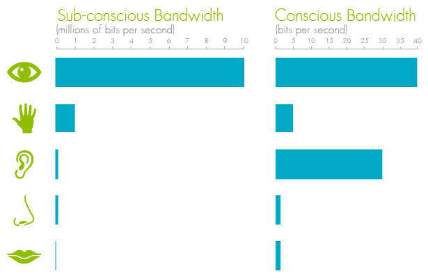
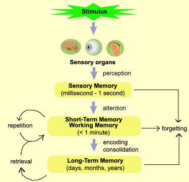
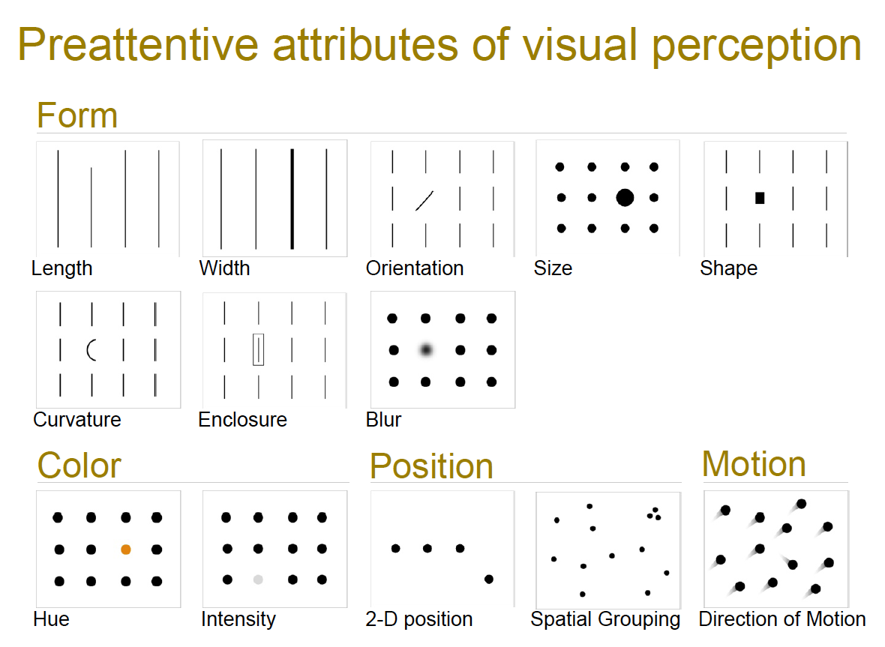
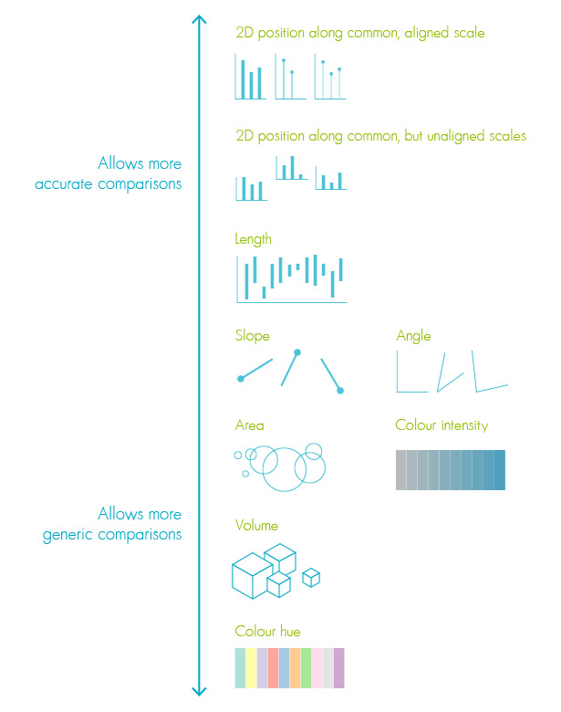

```{r global_options, echo=FALSE, include=FALSE}
library(knitr)
library(ggplot2)
library(gridExtra)
library(ggthemes)
library(reshape2)
library(plotrix)
library(dplyr)
library(choroplethr)
opts_chunk$set(echo=FALSE, warning=FALSE, message=FALSE, fig.width=14, fig.height=7)
```

## Sensory Bandwidths



---
## Memory



---

## Number of 5s


---

## Number of 5s


---



---
## Limits to Distinct Perception

* Ability to distinguish diminishes with increase in alternatives
* ~ 8 different hues, 4 different orientations and 4 different sizes
* Number of visual attributes at a time also severely limited (1 at a time)

---

## Pattern Recognition: Gestalt Principles


---

## Perceptual tasks and accuracy



---

## Bar, bubble and heatmap


---

## Representation of quantitative values

* points
* lines
* bars
* boxes
* shapes with varying 2-D areas
* shapes with varying color intensity

---
## Points - scatter and dot

```{r echo=FALSE, warning=FALSE,message=FALSE}

scatter=ggplot(mtcars,aes(mpg,qsec))+geom_point()+xlab("Miles per gallon") + ylab("Quarter mile time (in sec)")
dotplots=ggplot(mtcars,aes(cyl))+geom_dotplot()+xlab("Number of Cylinders")+ylab("")+theme(axis.text.y = element_blank(),axis.ticks.y=element_blank())
dfcyl=data.frame(table(mtcars$cyl))
points=ggplot(dfcyl,aes(Var1,Freq))+geom_point()+xlab("Number of Cylinders")+ylab("Number of Motor Vehicles")

grid.arrange(scatter,dotplots,points, ncol=2)
```

---

## Lines
Connect individual data values and/or display overall trend

```{r echo=FALSE, warning=FALSE,message=FALSE}
Year=(2001:2010)
set.seed(123)
Sales=rnorm(10,5000,300)
lndf=data.frame(Year,Sales)
linewithpoint=ggplot(lndf,aes(Year,Sales))+geom_line(aes(group=""))+geom_point()
linenopoint=ggplot(lndf,aes(Year,Sales))+geom_line(aes(group=""))
scatterlm=ggplot(mtcars,aes(mpg,qsec))+geom_point()+xlab("Miles per gallon") + ylab("Quarter mile time (in sec)")+geom_smooth(se=FALSE,method="lm",color="black")
grid.arrange(linewithpoint,linenopoint,scatterlm, ncol=2)
```

---
## Bars
line + width with no information = possibly better interpretation
```{r echo=FALSE}
bars0=ggplot(dfcyl,aes(Var1,Freq))+geom_bar(stat="identity")+xlab("Number of Cylinders")+ylab("Number of Motor Vehicles")
bars7=ggplot(dfcyl,aes(Var1,Freq))+geom_bar(stat="identity")+xlab("Number of Cylinders")+ylab("Number of Motor Vehicles")+scale_y_continuous(limits=c(7,14),oob=rescale_none)
grid.arrange(bars0,bars7,ncol=2)
```
<br> Always start with a base of ZERO for Bar Charts

---
## Boxes

```{r echo=FALSE,warning=FALSE,message=FALSE}
boxdf=mtcars[,1:2]
boxdfmelt=melt(boxdf)
levels(boxdfmelt$variable)=c("Miles per gallon","Number of Cylinders")
ggplot(boxdfmelt,aes(variable,value))+geom_boxplot()+xlab("")+ylab("")
```

---
## Shapes with 2-D areas (area-graphs)
```{r echo=FALSE}
# Color function from http://stackoverflow.com/questions/8197559/emulate-ggplot2-default-color-palette
gg_color_hue <- function(n) {
  hues = seq(15, 375, length=n+1)
  hcl(h=hues, l=65, c=100)[1:n]
}

Slice=c("A","B","C","D","E")
Value=c(24,20,19,21,16)

par(mfrow=c(1,2))
pie(Value,labels=Slice,col=gg_color_hue(length(Slice)))
pie3D(Value,labels=Slice,explode=0.1,col=gg_color_hue(length(Slice)))
```

---
## Shapes with 2-D or Bars?
```{r echo=FALSE}
dfpiebar=data.frame(Slice,Value)
barpiebar=ggplot(dfpiebar,aes(Slice,Value))+geom_bar(stat="identity")
barpiebar
```

---
## Bubble plot

```{r echo=FALSE}
bubble1=ggplot(mtcars,aes(mpg,qsec,size=hp))+geom_point()+xlab("Miles per gallon") + ylab("Quarter mile time (in sec)")
bubble2=ggplot(mtcars,aes(mpg,qsec,size=hp,color=cyl))+geom_point()+xlab("Miles per gallon") + ylab("Quarter mile time (in sec)")
grid.arrange(bubble1,bubble2,ncol=2)
```

---
## Encoding Categorical Variables
 
 * 2D position
 * Hue
 * Point Shape
 * Fill pattern
 * Line Style

---
## Encoding Categorical Variables

```{r echo=FALSE}
haireyecolor = as.data.frame(HairEyeColor)

dpos=ggplot(haireyecolor,aes(x=Hair,y=Freq))+geom_bar(stat="identity")

colbars=ggplot(haireyecolor,aes(x=Hair,y=Freq,fill=Sex))+geom_bar(stat="identity",position="dodge")
hecolorsub=haireyecolor%>%group_by(Hair,Eye)%>%summarise(count=sum(Freq))

ptshape=ggplot(hecolorsub,aes(x=Hair,y=count,shape=Eye,group=Eye))+geom_point()+geom_line()
hecolorsub$Group=with(hecolorsub, ifelse( hecolorsub$Eye=="Brown"|hecolorsub$Eye=="Blue", "Group1", "Group2"))

ptshapecolor= ggplot(hecolorsub,aes(x=Hair,y=count,shape=Eye,group=Eye,color=Group))+geom_point()+geom_line()

grid.arrange(dpos,colbars,ptshape,ptshapecolor,ncol=2)
```

---
## Encoding Categorical Variables

```{r echo=FALSE}

ggplot(hecolorsub,aes(x=Hair,y=count,linetype=Eye,group=Eye))+geom_line()

```

---
## Categorical Variable ---AAHHHHH!
```{r echo=FALSE}

layout(rbind(1,2), heights=c(7,1))  # put legend on bottom 1/8th of the chart
barplot(VADeaths, beside=TRUE,angle = 15+20*1:5,density = 20, col = "black",main="Death rates per 1000 in Virginia in 1940" )
par(mar=c(0, 0, 0, 0))
plot.new()
legend('top',rownames(VADeaths),angle = 15+20*1:5, density = 20, col = "black",ncol=4,bty ="n")
```

---

## Acknowledgement for images, content used in the presentation, and code for presentation

https://github.com/patilv/02-PerceptionandVariationsinGraphs
