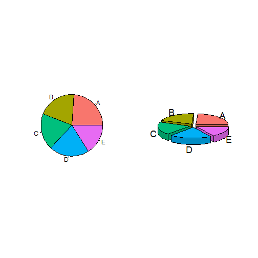
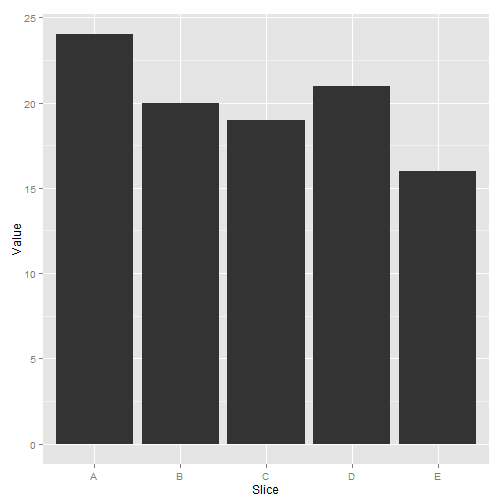
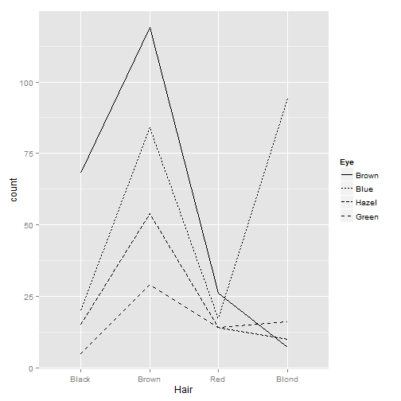

## Sensory Bandwidths

---
## Memory

---

## Number of 5s

---

## Number of 5s

---

---
## Limits to Distinct Perception

* Ability to distinguish diminishes with increase in alternatives
* ~ 8 different hues, 4 different orientations and 4 different sizes
* Number of visual attributes at a time also severely limited (1 at a time)

---

## Pattern Recognition: Gestalt Principles

---

## Perceptual tasks and accuracy

---

## Bar, bubble and heatmap

---

## Representation of quantitative values

* points
* lines
* bars
* boxes
* shapes with varying 2-D areas
* shapes with varying color intensity

---
## Points - scatter and dot

 

---

## Lines
Connect individual data values and/or display overall trend

 

---
## Bars
line + width with no information = possibly better interpretation
 
  Always start with a base of ZERO for Bar Charts

---
## Boxes

 

---
## Shapes with 2-D areas (area-graphs)
 

---
## Shapes with 2-D or Bars?
 

---
## Bubble plot

 

---
## Encoding Categorical Variables
 
 * 2D position
 * Hue
 * Point Shape
 * Fill pattern
 * Line Style

---
## Encoding Categorical Variables

 

---
## Encoding Categorical Variables

 

---
## Categorical Variable ---AAHHHHH!
 

---

## Acknowledgement for images, content used in the presentation, and code for presentation

https://github.com/patilv/02-PerceptionandVariationsinGraphs
